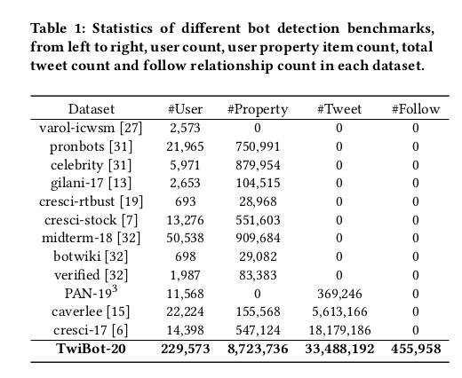

# twibot-20-twitter-bot-detection
__Operating System__: Ubuntu 18.04 (you may face issues importing the packages from the requirements.yml file if your OS differs).

Code repository for detecting Twitter bots using the TwiBot-20 [[1](#references)] dataset.

Reference from [[1](#references)]:

### TwiBot-20 Dataset
For getting the TwiBot-20 dataset, please contact the creators' email: __wind_binteng@stu.xjtu.edu.cn__

For more Twitter bot detection datasets, please check the datasets at the Botometer Bot Repository Datasets section: [link](https://botometer.osome.iu.edu/bot-repository/datasets.html)

### References
* [1] Shangbin Feng, Herun Wan, Ningnan Wang, Jundong Li, Minnan Luo, "TwiBot-20: A Comprehensive Twitter Bot Detection Benchmark": [arXiv](https://arxiv.org/abs/2106.13088)
